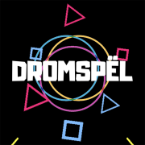

<!-- PROJECT LOGO -->
 

  
  <h3 align="center">Drömspel</h3>

<!-- ABOUT THE PROJECT -->
## À Propos du Projet

  

Projet réalisé dans le cadre de la formation "Apple Foundation Program".

Ce projet a été réalisé en groupe de 3 sur 1 mois de temps qui a compris : 
* La réalisation d'une idée et d'un plan de développement
* La réalisation d'une maquette
* Coder un prototype d'application

L'idée originale était de développer le "Netflix du jeu vidéo". Parce que nous vivons à une époque où il y a tellement de jeux qui sortent qu'il n'est pas toujours facile de trouver à quoi jouer.

Le but étant d'avoir une application qui enregistre les préférences utilisateurs pour lui proposer des jeux qui colleraient le mieux à ses attentes.

Ce projet a été codé en Swift/SwiftUI.

(<a href="#top">back to top</a>)
